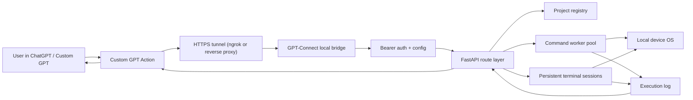
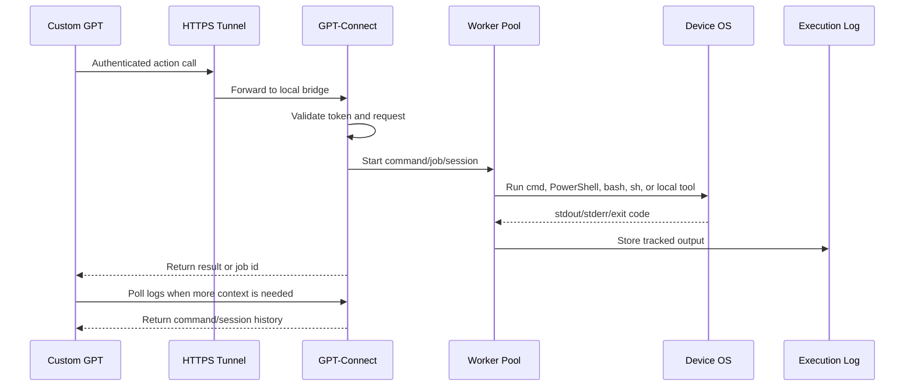
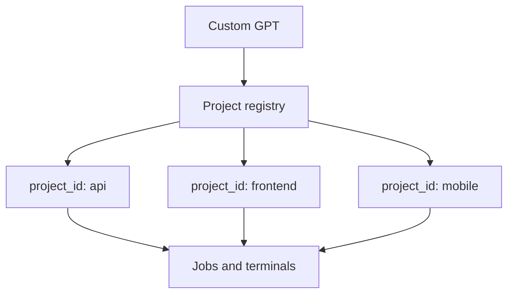

# GPT-Connect

GPT-Connect gives ChatGPT or a Custom GPT real, authenticated control over your own devices.

It is built for the main limitation of Codex and web ChatGPT: they can reason well, but they cannot directly see your local projects, run your local tools, inspect your terminal output, or keep live context from each machine unless something local exposes that control safely. GPT-Connect is that local bridge.

It runs on your device, uses your local OS permissions, and exposes a small private action surface that a Custom GPT can call through an HTTPS tunnel such as ngrok. There is no central hosted GPT-Connect server.

## What It Solves

- Lets ChatGPT work with your real files, commands, projects, logs, and terminals.
- Gives Codex-style local context to web ChatGPT through Custom GPT Actions.
- Keeps each device independent: every computer or phone runs its own local bridge.
- Lets one GPT collect context from multiple devices by calling each device's GPT-Connect URL.
- Runs command work in tracked jobs so command output can be retrieved later.
- Handles multiple projects without mixing paths or repeating long folder names.
- Works cross-platform: Windows, Ubuntu/Linux, and Android through Termux.

On Android/Termux, GPT-Connect can control the Termux environment and files/processes allowed by Android permissions. Full-device control depends on Android permissions, storage access, root, or extra tools installed by the user.

## How It Is Different

GPT-Connect is similar in spirit to local-control tools like OpenClaw: the AI can act on your real machine. The difference is that GPT-Connect is designed as a simple local bridge for Custom GPT usage. You run it on your own device, expose it only when needed, and authenticate every call.

It is not a cloud command server. The server process is local to your device.

## Quick Start

Windows:

```bat
run.bat
```

Ubuntu/Linux:

```bash
sudo apt-get update
sudo apt-get install -y python3 python3-venv
./run.sh
```

Android/Termux:

```bash
pkg update
pkg install python git
./run.sh
```

The launcher opens a settings screen first. Set or randomize the API key, configure the port, add your ngrok token if you want web access, then start GPT-Connect.

## Using It From ChatGPT

1. Start GPT-Connect on the device.
2. Start tunnel mode so the device gets an HTTPS URL.
3. Import `gpt-actions.openapi.yaml` into a private Custom GPT Action.
4. Use the generated API key as the Custom GPT bearer token.
5. Ask the GPT to inspect projects, run commands, read logs, or gather device context.

Every device can have its own URL and key. A single Custom GPT can switch between devices by using the right configured action or schema.

## Device Context Sync

GPT-Connect does not need a central sync server. Each device keeps its own local state, projects, terminals, and logs. The Custom GPT becomes the sync layer by asking each device for current context and combining the answers in the chat.

Example setup:

- Desktop GPT-Connect for full project folders and build tools.
- Laptop GPT-Connect for another repo or work environment.
- Android/Termux GPT-Connect for phone-side scripts, files, and Termux tools.
- One Custom GPT that can ask each device what it knows, then decide where to run the next command.

## Architecture



## Request Flow



## Multi-Threaded Execution

GPT-Connect is optimized for many commands and tools running at the same time.

- Each shell command becomes a tracked job.
- Jobs run through a bounded thread pool.
- Default worker count is `max(4, CPU cores * 4)`.
- Long-running work can run asynchronously while the GPT keeps working.
- Output is stored in memory by job/session id so the GPT can retrieve it later.
- Terminal sessions are persistent, so multi-step work can keep state.

Override worker count:

Windows:

```powershell
$env:LOCALCONTROL_MAX_SHELL_WORKERS = "32"
```

Linux/Termux:

```bash
export LOCALCONTROL_MAX_SHELL_WORKERS=32
```

## Multi-Project Handling

GPT-Connect can manage many project folders from one running bridge.

Register a project once, then the GPT can refer to it by `project_id` instead of repeating paths. This makes it easier to work across multiple repos, apps, folders, or client projects.



This lets the GPT do work like:

- Search project A while tests run in project B.
- Run git, build, or test commands inside the correct folder.
- Keep separate terminal sessions per project.
- Retrieve logs and command output by job id.

## Platform Support

| Platform | How to run | Shell support |
| --- | --- | --- |
| Windows | `run.bat` or Windows executable | PowerShell, `cmd.exe`, `auto` |
| Ubuntu/Linux | `./run.sh` or Linux executable | `bash`, `sh`, PowerShell if installed, `auto` |
| Android/Termux | `./run.sh` from Termux | `bash`, `sh`, Termux tools |

Release builds include:

- `GPT-Connect-windows-x64-standalone.exe`
- `GPT-Connect-windows-x64-standalone.zip`
- `GPT-Connect-linux-x64-standalone`
- `GPT-Connect-linux-x64-standalone.tar.gz`

## Local UI

After startup, the control panel is available on the device:

```text
http://127.0.0.1:8765/ui
```

Use it to change the API key, port, ngrok token, tunnel settings, and open terminal sessions.

## Safety Model

GPT-Connect is designed for a trusted personal environment.

- It requires bearer authentication.
- It binds locally by default.
- Public access should go through HTTPS tunnel or reverse proxy.
- The API key should be treated like a password.
- Commands run with the permissions of the user account that started GPT-Connect.
- Android/Termux access is limited by Android permissions unless you add more privileges yourself.

## Development

Windows:

```powershell
.\.venv\Scripts\python.exe -m pytest
.\.venv\Scripts\python.exe scripts\export_openapi.py
```

Linux/Termux:

```bash
./.venv/bin/python -m pytest
./.venv/bin/python scripts/export_openapi.py
```
