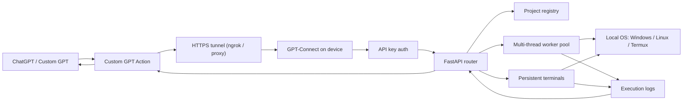
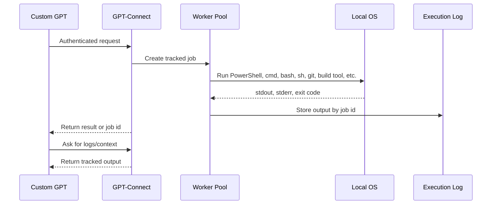
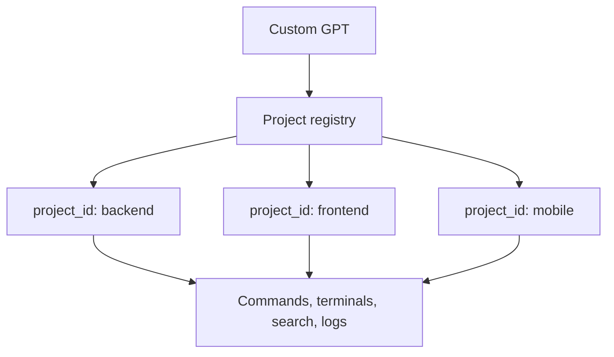

# GPT-Connect

GPT-Connect is a local bridge that lets ChatGPT or a Custom GPT control your own devices with authentication, using the same permissions as the account that runs it.

Its main purpose is to avoid the Codex local-machine limit: the model can reason about work, but it cannot directly access your running device, local projects, terminals, files, processes, or command output. GPT-Connect runs on the device and gives the GPT that missing local execution and context.

It is like an OpenClaw-style local control layer, but without a hosted command server. Each device runs its own bridge. If you start it as Administrator or root, it can see and control anything that privileged OS account can access.

## Install

Download packages from the [latest GitHub release](https://github.com/shahidx0x/gpt-connector/releases/latest).

Windows:

[Download Windows executable](https://github.com/shahidx0x/gpt-connector/releases/latest/download/GPT-Connect-windows-x64-standalone.exe)

```bat
GPT-Connect-windows-x64-standalone.exe
```

Ubuntu/Linux:

[Download Linux package](https://github.com/shahidx0x/gpt-connector/releases/latest/download/GPT-Connect-linux-x64-standalone.tar.gz)

```bash
tar -xzf GPT-Connect-linux-x64-standalone.tar.gz
chmod +x GPT-Connect-linux-x64-standalone
./GPT-Connect-linux-x64-standalone
```

Android/Termux:

```bash
pkg update
pkg install python git
git clone https://github.com/shahidx0x/gpt-connector.git
cd gpt-connector
./run.sh
```

Termux control is limited to what Android permissions, storage access, Termux tools, root, or user-granted access allow.

## What It Does

- Gives ChatGPT local device context: files, projects, commands, terminals, logs.
- Works from web ChatGPT through Custom GPT Actions.
- Runs on Windows, Ubuntu/Linux, and Android through Termux.
- Lets one GPT talk to multiple devices and combine their context in chat.
- Runs commands as tracked jobs with retrievable output.
- Handles many projects from one bridge.
- Uses local OS permissions; no hosted GPT-Connect server is required.

## How ChatGPT Uses It

1. Start GPT-Connect on the device.
2. Start tunnel mode to get an HTTPS URL.
3. Import `gpt-actions.openapi.yaml` into a private Custom GPT Action.
4. Use the generated API key as the bearer token.
5. Ask the GPT to inspect projects, run commands, read logs, or gather context.

Each device can have its own GPT-Connect URL and API key.

## Architecture Flow



## Command Flow



## Multi-Threaded Work

GPT-Connect runs commands through a bounded worker pool.

- Default workers: `max(4, CPU cores * 4)`.
- Each command runs as a separate tracked job.
- Long jobs can run async.
- Output is stored by job/session id.
- Persistent terminals keep multi-step context alive.

Set worker count:

```bash
LOCALCONTROL_MAX_SHELL_WORKERS=32
```

## Multi-Project Handling

Register project folders once, then the GPT can work by `project_id`.



This lets the GPT:

- Search one project while tests run in another.
- Run git/build/test commands in the correct folder.
- Keep separate terminal sessions per project.
- Retrieve output later by job id.

## Device Context Sync

GPT-Connect does not use a central sync server.

Each device keeps its own local state. The Custom GPT syncs context by asking each device what it sees, then combining that information in the chat.

Example:

- Desktop bridge: main repos and build tools.
- Laptop bridge: separate work environment.
- Android/Termux bridge: phone-side scripts and files.
- One Custom GPT: gathers context from all of them and chooses where to act.

## Local Control UI

After startup:

```text
http://127.0.0.1:8765/ui
```

Use it to change the API key, port, ngrok token, tunnel settings, and terminal sessions.

## Security Model

- Runs locally on your device.
- Binds to localhost by default.
- Requires bearer authentication.
- Public access should go through HTTPS tunnel or reverse proxy.
- Commands run with the same permissions as the account that started GPT-Connect.
- If started as Administrator/root, GPT-Connect can access and control anything that privileged OS account can access.
- Treat the API key like a password.
